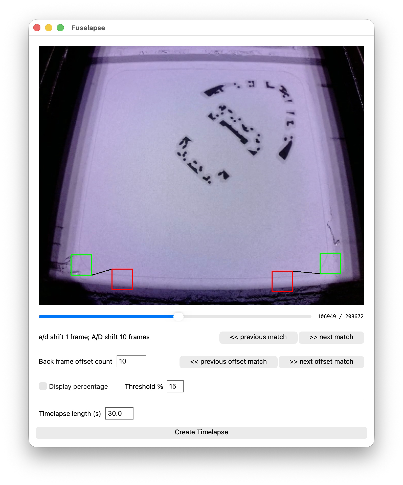

## Introduction

:::note

This article pseudo-aligns with my post "[Hacking Fuse Camera Feeds](/posts/hacking-fuse-camera-feeds)" as they were done at the same time for the same project. This post focuses on converting videos into smooth timelapses, and "[Hacking Fuse Camera Feeds](/posts/hacking-fuse-camera-feeds)" focuses on acquiring those video feeds in the first place.

:::

At the 3d printing lab I work at (Saint Louis University’s Center for Additive Manufacturing), we took delivery of 2 Formlabs Fuse 1+ SLS 3d printers. These printers have been excellent from an engineering, delivery, and education perspective. A significant part of our mission is outreach and education. We have resources and equipment most people have never even imagined, much less heard of or had access to. We want to share that with as many people as possible. As such, acquiring and publishing high quality media is important to us.

Our traditional filament printers (mostly from Bambu Lab) all provide the ability to generate smooth timelapses from the slicer. We typically record these timelapses for important or interesting prints. We have built custom Arduino-driven hardware to trigger photos during Polyjet prints, and we don't typically print showcase pieces on SLA/DLP printers. That meant SLS was the only technology we had that we could not get timelapses from (but wanted to).

As eluded to in "[Making Smooth Fuse Timelapses](/posts/making-smooth-fuse-timelapses)", there is no built in timelapse feature, and we certainly could not put a button, Arduino, and a DSLR inside the Fuse's chamber. This post covers the story of how I made this timelapse, and a tool to create others like it:

<video playsinline controls loop muted autoplay>
  <source src="timelapse.mp4" />
</video>

## Defining "Timelapse"

In this context, timelapses are typically a saved frame every $$n$$ seconds (or every $$n$$ frames), or a saved frame every time the printer is in a certain state. This project is an implementation of the latter: we are seeking to save a frame each time the doser reaches it's "home" on each side of the print area, and the overall exposure is such that we can see the sintered layer.

I started by considering building some kind of OpenCV-powered shape recognition system to identify the doser (black rectangle) as it traveled across the print area, but ultimately decided to keep it simple with a basic luminance check at 4 standard regions in the video. I feel safe about this decision because of the Fuse printer's extremely standard environment. The video feed will not become lighter/darker when the room lights turn on or off, will not change in hue when someone with a bright shirt walks by.

The first step was to identify a region on each side of the video clip that experiences a significant luminance swing when the doser crosses it, but otherwise stays relatively stable. These are notated by the green squares in the clip below. Both of these boxes are (mostly) outside of the printable area and happen to be in almost complete darkness when the doser crosses.

To add additional protection from false positive frames, I added "negative regions". If a check box's luminance drops below the threshold (signifying the doser's presence), we also check the negative box to make sure it is not a global exposure change or light change that triggered it.

<video playsinline controls loop muted autoplay>
  <source src="across.mp4" />
</video>

Looking at the video, it is easy to see that setting a $$15\%$$ threshold will reliably and accurately detect the doser crossing. Now, every time the value drops, we mark that frame for the timelapse.

```plot luminosity="luminosity.csv"
Plot.plot({
  marginBottom: 80,
  height: 400,
  color: {
    legend: true,
    domain: [
      "Positive Region 1",
      "Positive Region 2",
      "Negative Region 1",
      "Negative Region 2",
    ],
    range: [
      "green",
      "darkgreen",
      "red",
      "darkred",
    ],
  },

  x: {
    label: "Frame",
  },

  y: {
    label: "Luminosity",
  },

  marks: [
    Plot.line(luminosity.filter((d) => d.frame <= 61450), {
      x: "frame",
      y: "posbox1",
      stroke: "green",
      strokeWidth: 2,
      curve: "linear",
    }),

    Plot.line(luminosity.filter((d) => d.frame >= 61340), {
      x: "frame",
      y: "posbox2",
      stroke: "darkgreen",
      strokeWidth: 2,
      curve: "linear",
    }),

    Plot.line(luminosity.filter((d) => d.frame <= 61450), {
      x: "frame",
      y: "negbox1",
      stroke: "red",
      strokeWidth: 2,
      curve: "linear",
    }),

    Plot.line(luminosity.filter((d) => d.frame >= 61340), {
      x: "frame",
      y: "negbox2",
      stroke: "darkred",
      strokeWidth: 2,
      curve: "linear",
    }),

    ...[
      61273,
      61278,
      61294,
      61350,
      61469,
      61476,
      61490,
    ].map((frame) =>
      Plot.ruleX([frame], {
        stroke: "gray",
        strokeWidth: 2,
        strokeDasharray: "3,2",
      })
    ),

    Plot.image(
      [{ frame: 61273, src: "61273.png" }],
      {
        x: "frame",
        y: 0,
        dy: 60,
        dx: 35,
        src: "src",
        width: 70,
        frameAnchor: "bottom",
        preserveAspectRatio: "xMinYMin meet",
        clip: false,
      }
    ),

    Plot.image(
      [{ frame: 61278, src: "61278.png" }],
      {
        x: "frame",
        y: 0,
        dy: -30,
        dx: 35,
        src: "src",
        width: 70,
        frameAnchor: "bottom",
        preserveAspectRatio: "xMinYMin meet",
        clip: false,
      }
    ),

    Plot.image(
      [{ frame: 61294, src: "61294.png" }],
      {
        x: "frame",
        y: 0,
        dy: -90,
        dx: 35,
        src: "src",
        width: 70,
        frameAnchor: "bottom",
        preserveAspectRatio: "xMinYMin meet",
        clip: false,
      }
    ),

    Plot.image(
      [{ frame: 61350, src: "61350.png" }],
      {
        x: "frame",
        y: 0,
        dy: -30,
        dx: 35,
        src: "src",
        width: 70,
        frameAnchor: "bottom",
        preserveAspectRatio: "xMinYMin meet",
        clip: false,
        className: "plotImg"
      }
    ),

    Plot.image(
      [{ frame: 61469, src: "61469.png" }],
      {
        x: "frame",
        y: 0,
        dy: -30,
        dx: -35,
        src: "src",
        width: 70,
        frameAnchor: "bottom",
        preserveAspectRatio: "xMinYMin meet",
        clip: false,
      }
    ),

    Plot.image(
      [{ frame: 61476, src: "61476.png" }],
      {
        x: "frame",
        y: 0,
        dy: 60,
        dx: 35,
        src: "src",
        width: 70,
        frameAnchor: "bottom",
        preserveAspectRatio: "xMinYMin meet",
        clip: false,
      }
    ),

    Plot.image(
      [{ frame: 61490, src: "61490.png" }],
      {
        x: "frame",
        y: 0,
        dy: -30,
        dx: 35,
        src: "src",
        width: 70,
        frameAnchor: "bottom",
        preserveAspectRatio: "xMinYMin meet",
        clip: false,
      }
    ),
  ],
});
```

*Graph 1:* Lines of the check region's luminances with interesting frames highlighted.

We get lucky that the picture gets washed out every layer just as the doser crosses the middle of the print region. This means as the doser triggers the other check region as it is almost done with that layer, the luminance does not drop below our threshold, and the frame is automatically ignored.

## Falling-edge timelapse

Setting our timelapse using the falling edge works *almost perfectly*:

<video playsinline controls loop muted autoplay>
  <source src="timelapse-no-offset.mp4" />
</video>

The actual build progress looks great, but we are stuck seeing the doser as it triggers the boxes. The doser's consistent behavior and the regions being roughly equal distance from each side means we can use a simple negative offset of 10 frames.

$$
\begin{aligned}
\text{Frame}_{\text{to save}} &= \text{Frame}_{\text{from trigger}} - 10 \\
\text{Frame}_{\text{to save}} &= 61469 - 10 \\
\text{Frame}_{\text{to save}} &= 61459
\end{aligned}
$$

Running this on every matched frame works great, and results in our finalized timelapse:

## The clean timelapse

As you saw at the beginning of this post, this method leads to very clean timelapses, where the layers progress as if by magic.

<video playsinline controls loop muted autoplay>
  <source src="timelapse.mp4" />
</video>

## Making it useful

Just like in "[Hacking Fuse Camera Feeds](/posts/hacking-fuse-camera-feeds)", making this useful means matching the same user requirements. The solution must be:

1. Easy to create a timelapse
2. Approachable by people who are technical, but not necessarily software people
3. Something that does not interfere with the existing printing process or workflow
4. Is something that is stable and able to be customized (things like check regions, threshold, and offset) so the utility is still useful under other printer/material conditions without code modification.

So to solve these constraints, I built a GUI app that makes customization and video creation easy.



The project is available on GitHub at [jackcrane/fuselapse](https://github.com/jackcrane/fuselapse)